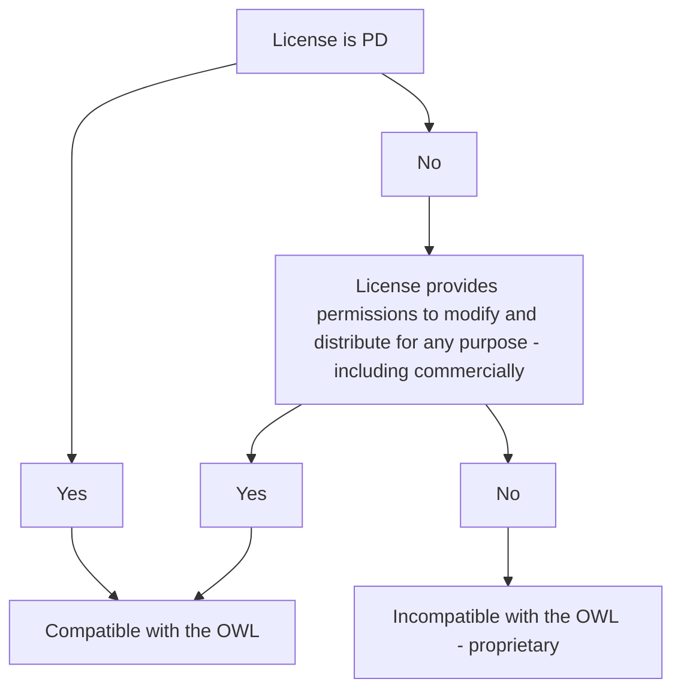

The OWL is only designed to be compatible with free open-source licenses.  This graph shows how a license is chosen to be either OWL-compatible or not.

This graph is completely made with **Mermaid**, a graph renderer. The source code of this document contains the graph code. It can help you with Mermaid graphing ;)
